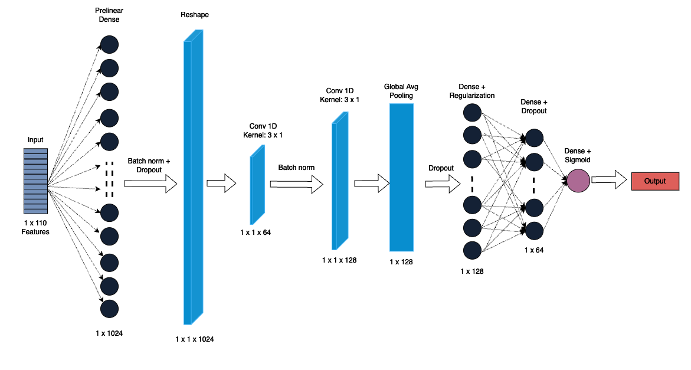

# DeepLearning-Based-Covid-Metabolomics

## Team
Vedant Mahangade

## Description
This project aims to implement a deep learning approach to perform biomarker analysis on COVID-19 metabolite data. Metabolites are small molecules in the body that play a key role in biochemical reactions essential for maintaining cellular functions, producing energy, supporting growth, and responding to environmental changes. Viral influences like COVID-19 affect the body on multiple levels, including significant disruptions in metabolic processes. Disruptions in metabolite levels are closely tied to disease severity and the body's ability to combat infection. Analyzing and comparing these variations across groups could help identify biomarkers for disease severity, which could be key in early detection, prognosis, and even therapeutic interventions for COVID-19.

The primary objective is to analyze metabolite expression and identify key features linked to disease severity.

Key Features:
* Model Architecture: A custom neural network model designed to process metabolite data, leveraging convolutional and fully connected layers.
* Regularization Techniques: Integrated regularization methods (e.g., dropout and L2 regularization) to encourage sparsity and prevent overfitting, ensuring robust feature selection.
* Explainability: Post-training analysis using explainability techniques to interpret the model's decision-making process and identify the most significant metabolites as potential biomarkers.
* Outcome: Identification of impactful metabolites associated with COVID-19 severity, offering insights into early detection, prognosis, and potential therapeutic interventions.

## Data
The data for this project is based on two different studies 
- [The plasma metabolome of long COVID patients two years after infection](https://www.nature.com/articles/s41598-023-39049-x)
- [Targeted metabolomics identifies high performing diagnostic and prognostic biomarkers for COVID-19](https://www.nature.com/articles/s41598-021-94171-y)

All the required data files are provided in the Data availability section of these research papers and are also present under the data folder.

### Data processing
1. Both studies had metabolite data and metadata
    - Study 1 had 108 samples, 110 metabolites
    - Study 2 had 161 samples, 109 metabolites
2. Mapping metabolite names
    - Although originating from same parent study both had different metabolite names
    - Example: 1st datasource had metabolite named as C4, equivalent for that in study 2 is Butyrylcarnitine
    - Using a reference database (The Human Metabolome Database - hmdb) the appropriate names were pulled and mapped
3. Combined metabolite data with metadata
4. Merged to get one dataset
5. Imputed Missing values
    - Categorical with mode
    - Numerical with median

## Hybrid CNN
Important aspects:
* Handling tabular data
    - Prelinear dense layer
    - Reshape layer
* Handling overfiting:
    - Dropout
    - Class weights
    - L2 Regularization

## Important files
    .
    ├── data/
    │   ├── covid19_metabolites.csv: Final preprocessed dataset obtained from data_preprocessing.ipynb
    │   ├── PM108_metabolite_abundance.txt: Metabolite count data obtained from study 1
    │   ├── PM108_metadata.txt: Study 1 patient metadata
    │   ├── TM161_metabolite_abundance.txt: Metabolite count data obtained from study 2
    │   └── TM161_metadata.txt: Study 2 patient metadata
    │
    ├── files/: Files generated during analysis and used for presentation
    │
    ├── scripts/
    │   ├── biomarker analysis.ipynb: Feature importance and Metabolite analysis on trained model
    │   ├── cnn training.ipynb: Trains and validates custom CNN
    │   ├── data_preprocessing.ipynb: Peforms steps mentioned under 'Data processing' section
    │   ├── exploratory_data_analys.ipynb: Intermediary EDA on processed data
    │   └── metbio1d.net: Custom hybrid CNN model displayed under 'Hybrid CNN' section
    │
    ├── .gitignore
    ├── README.md
    └── requirements.txt
